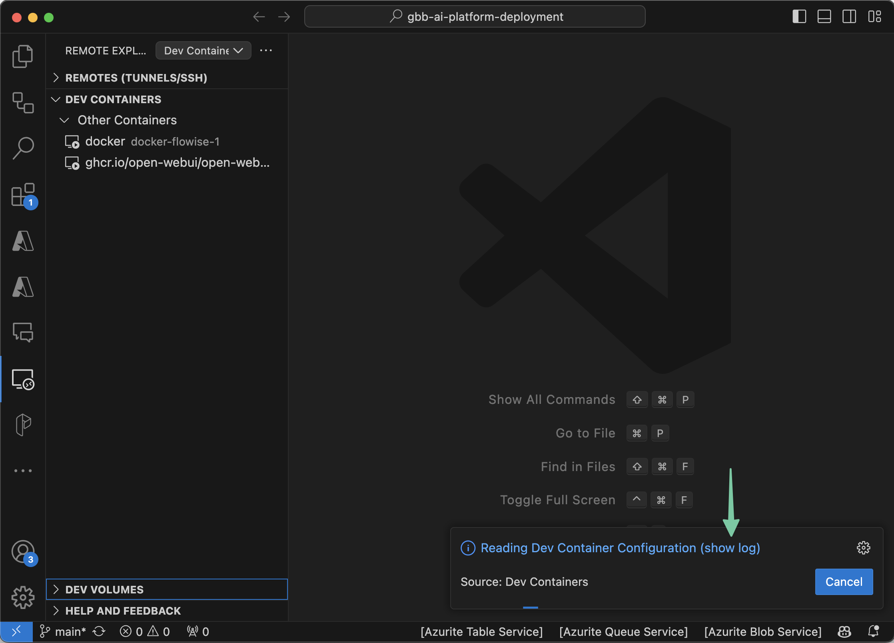
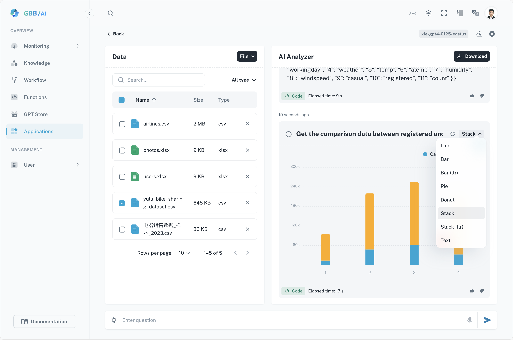

# GBB/AI Platfrom

 

> [!NOTE]
> **This solution is intended for demonstration purposes only. When deploying it to your own subscription, ensure you take responsibility for managing any potential errors. Please avoid sharing this externally as it's still undergoing refinement.**  

#### Demo site: https://aigbb.com/

#### Documentation: https://aigbb.com/gbb-ai/documentation/introduction

## One-click deployment using Docker (Recommended)

### Dependancies

1. VS Code
2. Docker: [Install Docker Engine | Docker Docs](https://docs.docker.com/engine/install/)
3. Dev Containers (VS Code extention): [Dev Containers](https://marketplace.visualstudio.com/items?itemName=ms-vscode-remote.remote-containers)

### Steps

1. Clone the entire repository onto your local disk.
2. Open the folder using VS Code.

 

3. Click the `Remote Explorer` icon and follow the instructions depicted in the following screenshots. If your screen appears different, please close and reopen the VS window, and then reopen the folder.

 

 

 

4. After the container is built, open a new terminal and change the directory to the `terraform-mvp` folder.

 

5. Rename the file **_variables_need_replace.tf.sample_** by removing `.sample`.
6. Provide values for the variables in the **_variables_need_replace.tf_** file. If necessary, you can also modify the variables in the **_variables_by_default.tf_** file. The variables marked with `nullable = true` are not mandatory. If values are not provided for these variables, certain functionalities like creating images using DallE-3 and web searching with Bing will be unavailable.
7. To authenticate, run `az login --tenant xxxxxx`. While you can ignore the `--tenant` parameter, it's recommended to include it if you have multiple tenants.
8. Run `terraform init` to install the terraform modules declared in the [terraform.tf](http://terraform.tf/) file.
9. Run `terraform plan` to determine how many resources need to be created.
10. Run `terraform apply -auto-approve` to execute the deployment process. After the deployment is complete, the following outputs will appear in the terminal:

 

11. Open the `frontend_static_web_app_url` in your browser (Edge is recommended).

> [!NOTE]
> **The steps below are only required for Mac users.**  
> Due to some issues with SWA, the frontend hasn't been pushed to the cloud after completing the aforementioned steps. As a result, you'll need to do this manually on your Mac's bare metal.

12. Before proceeding, you need to install the following packages on your Mac:

 - Node.js (version 18 or later): [Node.js — How to install Node.js (nodejs.org)](https://nodejs.org/en/learn/getting-started/how-to-install-nodejs) (Required by SWA)
 - SWA: <https://azure.github.io/static-web-apps-cli/docs/use/install/> (Deploys static web app content)

13. Navigate to your Azure portal, access the Static Web App service, open the resource you just created, and copy the deployment token.

 

14. On your Mac, open a terminal and navigate to the `frontend` folder (**refer to the picture below to select the correct frontend folder**). 

 

15. Run the command provided below. Don't forget to substitute `<YOUR-DEPLOYMENT-TOKEN-PLACEHOLDER>` with your actual deployment token: `swa deploy ./dist --env=production --deployment-token=<YOUR-DEPLOYMENT-TOKEN-PLACEHOLDER>`

16. Wait until the execution finishes. Then, open the `frontend_static_web_app_url` in your browser (Edge is recommended).

## One-click deployment on bare metal (Mac Users)

### Dependancies

1. az cli: [How to install the Azure CLI | Microsoft Learn](https://learn.microsoft.com/en-us/cli/azure/install-azure-cli) (User login for authentication)
2. Terraform: [Install Terraform | Terraform | HashiCorp Developer](https://developer.hashicorp.com/terraform/tutorials/aws-get-started/install-cli) (Deploys the resources)
3. Python 3.11: [Download Python | Python.org](https://www.python.org/downloads/) (Inserts records into CosmosDB)
4. Node.js (version 18 or later): [Node.js — How to install Node.js (nodejs.org)](https://nodejs.org/en/learn/getting-started/how-to-install-nodejs) (Required by SWA)
5. SWA: <https://azure.github.io/static-web-apps-cli/docs/use/install/> (Deploys static web app content)
6. jq (version 1.7 or later): <https://jqlang.github.io/jq/download/> (Replaces placeholders in JavaScript)

### Steps

1. Clone the entire repository onto your local disk and use the command `cd terraform-mvp` to switch to the target folder.
2. Rename the file **_variables_need_replace.tf.sample_** by removing `.sample`.
3. Provide values for the variables in the **_variables_need_replace.tf_** file. If necessary, you can also modify the variables in the **_variables_by_default.tf_** file. The variables marked with `nullable = true` are not mandatory. If values are not provided for these variables, certain functionalities like creating images using DallE-3 and web searching with Bing will be unavailable.
4. Run `az login` to authenticate.
5. Run `terraform init` to install the terraform modules declared in the [terraform.tf](http://terraform.tf/) file.
6. Run `terraform plan` to determine how many resources need to be created.
7. Run `terraform apply -auto-approve` to execute the deployment process. After the deployment is complete, the following outputs will appear in the terminal:

 

8. Open the `frontend_static_web_app_url` in your browser (Edge is recommended).

## Clear Deployment

Run `terraform destroy -auto-approve` to remove your deployed resources.

## Notices

1. If you encounter `401` , please re-run the `az login` command to ensure you login into the correct tenant.
2. If you encounter a `502` error or any other errors, simply re-run the `terraform apply -auto-approve` command.
3. (Mac Users) Should you come across any "Permission denied" messages, simply prepend your command with `sudo`, as in `sudo terraform apply -auto-approve`.

## Manual deployment

Please refer to this Deployment Guide: (https://aigbb.com/gbb-ai/documentation/deploy-on-azure).

## Demo Videos

- [ChatDA (Data Analysis)](https://microsoftapc-my.sharepoint.com/:v:/g/personal/xle_microsoft_com/Ef8AAJw-Z8pPm0spMOpWU34BBcfY4UAx3PuEDdvAE28Y8g?e=rRCvgN&nav=eyJyZWZlcnJhbEluZm8iOnsicmVmZXJyYWxBcHAiOiJTdHJlYW1XZWJBcHAiLCJyZWZlcnJhbFZpZXciOiJTaGFyZURpYWxvZy1MaW5rIiwicmVmZXJyYWxBcHBQbGF0Zm9ybSI6IldlYiIsInJlZmVycmFsTW9kZSI6InZpZXcifX0%3D)
- [Function Managment Module](https://microsoftapc-my.sharepoint.com/:v:/g/personal/xle_microsoft_com/EZxnTrbShFRNimbNNKfOqp4BgcB1KYU14rqlmfy3DN3VkA?e=O14rVc&nav=eyJyZWZlcnJhbEluZm8iOnsicmVmZXJyYWxBcHAiOiJTdHJlYW1XZWJBcHAiLCJyZWZlcnJhbFZpZXciOiJTaGFyZURpYWxvZy1MaW5rIiwicmVmZXJyYWxBcHBQbGF0Zm9ybSI6IldlYiIsInJlZmVycmFsTW9kZSI6InZpZXcifX0%3D)
- [TV Copilot](https://microsoftapc-my.sharepoint.com/:v:/g/personal/xle_microsoft_com/ESQRuinQghVOnf7vJ958ZygBavCMivZPINS5ybP7yACeFw?e=V1NkJQ&nav=eyJyZWZlcnJhbEluZm8iOnsicmVmZXJyYWxBcHAiOiJTdHJlYW1XZWJBcHAiLCJyZWZlcnJhbFZpZXciOiJTaGFyZURpYWxvZy1MaW5rIiwicmVmZXJyYWxBcHBQbGF0Zm9ybSI6IldlYiIsInJlZmVycmFsTW9kZSI6InZpZXcifX0%3D)
- [GPT4V + DallE-3](https://microsoftapc-my.sharepoint.com/:v:/g/personal/xle_microsoft_com/ETECbtx-CAZAujAtMJlkhMABxW4XtF7EiCbrRrLJwEe9PQ?e=3U2nj9&nav=eyJyZWZlcnJhbEluZm8iOnsicmVmZXJyYWxBcHAiOiJTdHJlYW1XZWJBcHAiLCJyZWZlcnJhbFZpZXciOiJTaGFyZURpYWxvZy1MaW5rIiwicmVmZXJyYWxBcHBQbGF0Zm9ybSI6IldlYiIsInJlZmVycmFsTW9kZSI6InZpZXcifX0%3D)
- [GPT4V + Function Calling](https://microsoftapc-my.sharepoint.com/:v:/g/personal/xle_microsoft_com/EWt4wRTgjPxMl9bLX9bYYCwBN2RmmV6H7lkkQUvrm24sHQ?e=mwtdHZ&nav=eyJyZWZlcnJhbEluZm8iOnsicmVmZXJyYWxBcHAiOiJTdHJlYW1XZWJBcHAiLCJyZWZlcnJhbFZpZXciOiJTaGFyZURpYWxvZy1MaW5rIiwicmVmZXJyYWxBcHBQbGF0Zm9ybSI6IldlYiIsInJlZmVycmFsTW9kZSI6InZpZXcifX0%3D)

## Screenshots

ChatDA Application

 

Function dashboard

 

Function editting page

 

Knowledge base dashboard

 

Knowledge base page

 

## Note

This is a sophisticated platform that's ever-evolving. We greatly value your understanding and patience as we strive to enhance and broaden the platform's capabilities.
