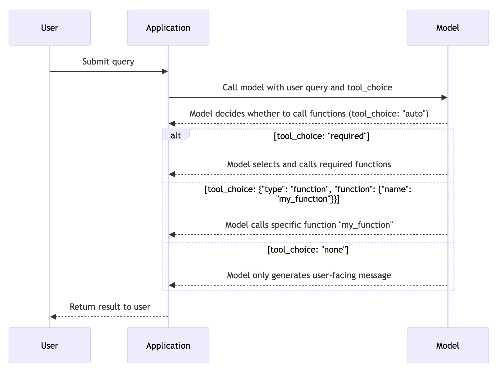

***function sequence flow***


```Mermaid
sequenceDiagram
    participant User
    participant Application
    participant Model

    User->>Application: Submit query
    Application->>Model: Call model with user query and defined functions
    Model-->>Application: Responds with function call(s) (stringified JSON)
    Application->>Application: Parse JSON and call the function(s)
    Application-->>Function: Execute the function(s)
    Function-->>Application: Return function result(s)
    Application->>Model: Append function response and call model again
    Model-->>Application: Summarize results
    Application-->>User: Return summary to user
```


***model choose function call options***


```Mermaid
sequenceDiagram
    participant User
    participant Application
    participant Model

    User->>Application: Submit query
    Application->>Model: Call model with user query and tool_choice
    Model-->>Application: Model decides whether to call functions (tool_choice: "auto")
    
    alt tool_choice: "required"
        Model-->>Application: Model selects and calls required functions
    else tool_choice: {"type": "function", "function": {"name": "my_function"}}
        Model-->>Application: Model calls specific function "my_function"
    else tool_choice: "none"
        Model-->>Application: Model only generates user-facing message
    end

    Application-->>User: Return result to user
```

***
Supported models
Not all model versions are trained with function calling data. Function calling is supported with the following models: gpt-4o, gpt-4o-2024-05-13, gpt-4-turbo, gpt-4-turbo-2024-04-09, gpt-4-turbo-preview, gpt-4-0125-preview, gpt-4-1106-preview, gpt-4, gpt-4-0613, gpt-3.5-turbo, gpt-3.5-turbo-0125, gpt-3.5-turbo-1106, and gpt-3.5-turbo-0613.

In addition, parallel function calls is supported on the following models: gpt-4o, gpt-4o-2024-05-13, gpt-4-turbo, gpt-4-turbo-2024-04-09, gpt-4-turbo-preview, gpt-4-0125-preview, gpt-4-1106-preview, gpt-3.5-turbo-0125, and gpt-3.5-turbo-1106.
***


1. Split into two requirements.txt files. The first one manages its own dependencies and some default dependencies. The second one manages dependencies introduced through function calls.

   ```sh
   pip install ipykernel jupyter
   pip install -r requirements.txt (including extra-requirements.txt)

2. Build a aigbb_functions module

All functions should be placed under the aigbb_functions module

Use import * so that every method is imported by default.

3. Create a new kernel and install the dependencies and module from the above steps

   Create a new environment to avoid interference：

      1. python -m venv aigbb_functions_kernel_1
      2. source  aigbb_functions_kernel_1/bin/activate
      3. pip install -r requirements.txt ( including extra-requirements.txt)
      4. pip install  ./aigbb_functions

4. Register the kernel (kernel location: /Users/huqianghui/Library/Jupyter/kernels/aigbb_functions_kernel_1)

   python -m ipykernel install --user --name=aigbb_functions_kernel_1 --display-name "Python (aigbb_functions_kernel_1)"

5. Use the command jupyter kernelspec list to check all kernels

6. Start the service and provide function call capability via RESTful API and Python script execution

   1. During the service startup process, choose the latest kernel

7. Use a Postman JSON definition file to view the definition of the two APIs.

   1. Use register to add functions
   2. Use execute to run code
