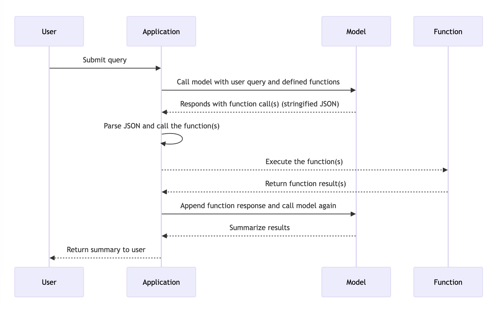
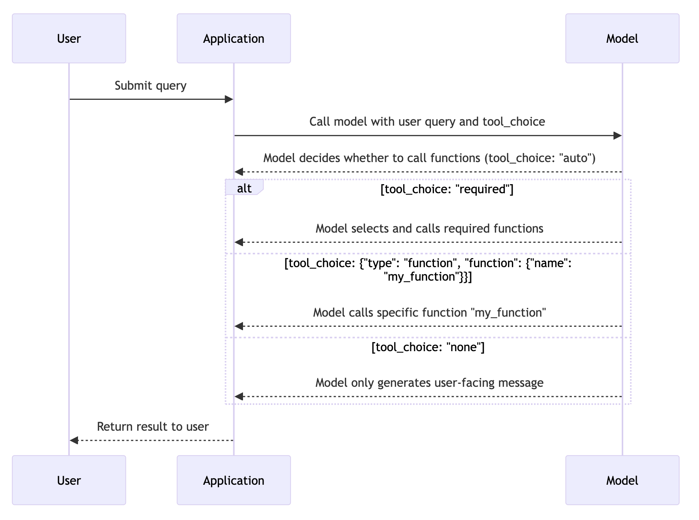

***function 本身的时序图如下***


```Mermaid
sequenceDiagram
    participant User
    participant Application
    participant Model

    User->>Application: Submit query
    Application->>Model: Call model with user query and defined functions
    Model-->>Application: Responds with function call(s) (stringified JSON)
    Application->>Application: Parse JSON and call the function(s)
    Application-->>Function: Execute the function(s)
    Function-->>Application: Return function result(s)
    Application->>Model: Append function response and call model again
    Model-->>Application: Summarize results
    Application-->>User: Return summary to user
```


***model选择function call的不同选项***


```Mermaid
sequenceDiagram
    participant User
    participant Application
    participant Model

    User->>Application: Submit query
    Application->>Model: Call model with user query and tool_choice
    Model-->>Application: Model decides whether to call functions (tool_choice: "auto")
    
    alt tool_choice: "required"
        Model-->>Application: Model selects and calls required functions
    else tool_choice: {"type": "function", "function": {"name": "my_function"}}
        Model-->>Application: Model calls specific function "my_function"
    else tool_choice: "none"
        Model-->>Application: Model only generates user-facing message
    end

    Application-->>User: Return result to user
```

***
支持的模型
并非所有模型版本都经过函数调用数据的训练。以下模型支持函数调用：gpt-4o、gpt-4o-2024-05-13、gpt-4-turbo、gpt-4-turbo-2024-04-09、gpt-4-turbo-preview、gpt-4-0125-preview、gpt-4-1106-preview、gpt-4、gpt-4-0613、gpt-3.5-turbo、gpt-3.5-turbo-0125、gpt-3.5-turbo-1106 和 gpt-3.5-turbo-0613。

此外，以下模型支持并行函数调用：gpt-4o、gpt-4o-2024-05-13、gpt-4-turbo、gpt-4-turbo-2024-04-09、gpt-4-turbo-preview、gpt-4-0125-preview、gpt-4-1106-preview、gpt-3.5-turbo-0125 和 gpt-3.5-turbo-1106。
***


1. 分成两个requirements.txt文件。第一个来管理本身的依赖和一些默认的依赖。第二个管理通过function call新引入的依赖

   pip install ipykernel jupyter
   pip install -r requirements.txt ( including extra-requirements.txt)
2. 构建一个aigbb_functions模块

   所有的functions 都放到 aigbb_functions 模块下

   通过import * 的方式，每个方法都默认变成引入。
3. 构建新的kernel ，安装上面两步的依赖和模块

   1. 构建一个新的环境，避免干扰：
      1. python -m venv aigbb_functions_kernel_1
      2. source  aigbb_functions_kernel_1/bin/activate
      3. pip install -r requirements.txt ( including extra-requirements.txt)
      4. pip install  ./aigbb_functions
4. 注册内核(kernel位置：/Users/huqianghui/Library/Jupyter/kernels/aigbb_functions_kernel_1)

   python -m ipykernel install --user --name=aigbb_functions_kernel_1 --display-name "Python (aigbb_functions_kernel_1)"
5. 通过命令行 jupyter kernelspec list 查看所有内核情况
6. 启动服务，对外restful API 提供function call的能力 python 脚本执行能力

   1. 在启动服务的过程中，选择对应的最新的内核
7. 可以通过postman的json定义文件，查看两个API的定义。

   1. 通过register来添加function
   2. 通过execute来执行代码
